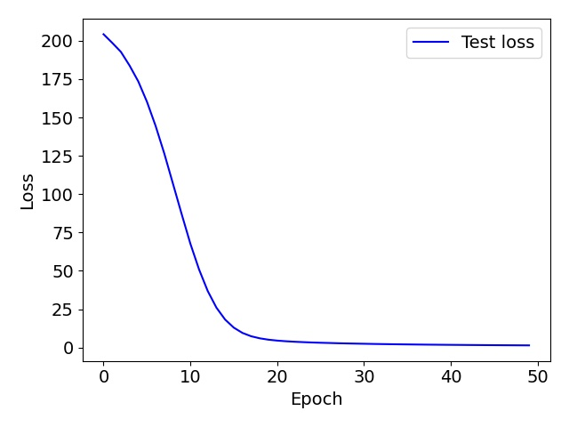
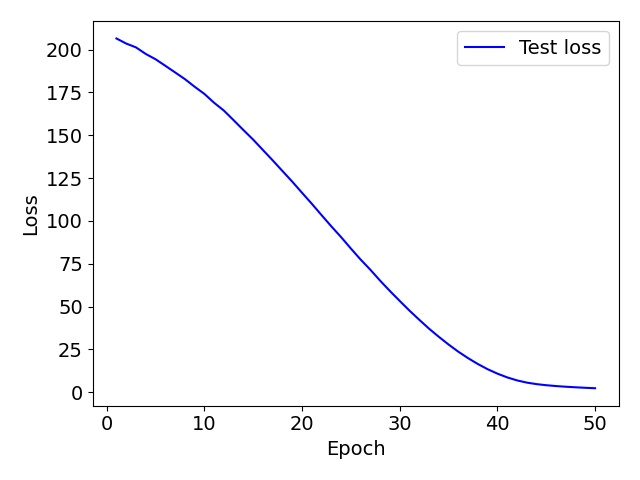
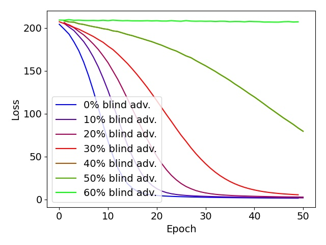
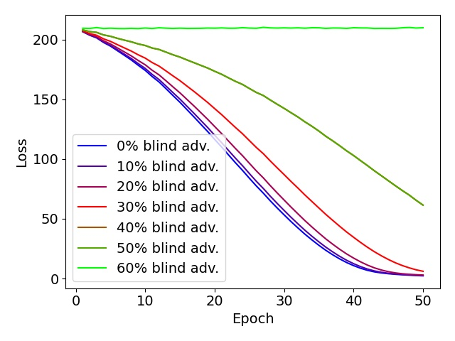
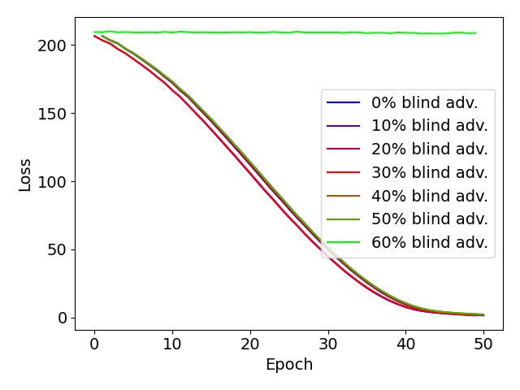
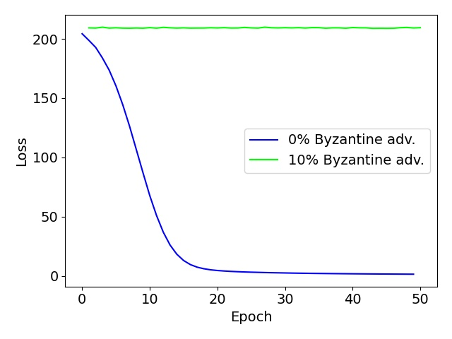
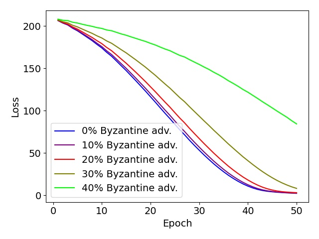
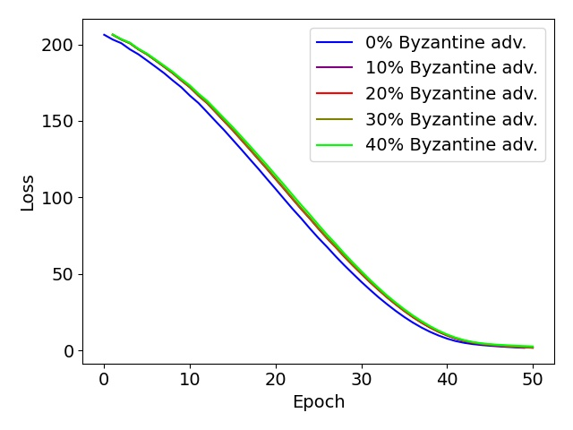

# SignSGD: Blind and Byzantine adversaries tolerance

In this project, we implement the Signum algorithm as described by Bernstein, Wang, Azizzadenesheli and Anandkumar in their 2018 paper *SignSGD: Compressed Optimisation for Non-Convex Problems*. The 2019 paper *SignSGD with Majority Vote is Communication Efficient and Fault Tolerant* from Bernstein, Zhao, Azizzadenesheli and Anandkumar also extends the properties of Signum by adding tolerance to blind adversaries. Our simple implementation aims at assessing the convergence and fault-tolerance of Signum. Therefore, we are evaluating how Signum might be able to resist to attacks from Byzantine adversaries.

Please refer to the following sections for more information:

1. [Usage](#package-usage)
2. [Documentation](#documentation)
3. [Results](#our-results)

## Package usage

### Model training and evaluation

Everything is handled by the *src/main.py* file. The following command allows to run some models:

`python3 src/main.py <nprocs> <data_type> [options]`

- `<nprocs>`: Number of processes to run.
- `<data_type>`: Supported datasets: LinReg, LogReg, MNIST and ImageNet.
- `-s`: Fix a global seed. Default: 42.
- `-i`: Choose a NUMBER of blind adversaries inverting their gradients signs. Default: 0.
- `-b`: Choose a NUMBER of Byzantine adversaries. Default: 0.
- `-n`: Choose a specific neural network. Available neural networks are gathered in the *src/nn/* subfolder. For MNIST dataset, you can either use TorchNet, which is the tutorial net from PyTorch or MNISTNet, which is our own net. For LinReg/LogReg, only LinRegNet/LogRegNet is available and consists in a feed-forward network. Finally, ImageNet supports ResNetX with X=18 or X=50. Default: MNISTNet. 
- `-o`: Choose a speficic distributed optimizer between DistSGD, SignSGD and Signum. Available optimizers are gathered in the *src/optim/* subfolder. Default: Signum.
- `-e`: Number of training epochs. Default: 10.
- `-m`: If True, will save the loss (and accuracy in case of classification) in a *results/* subfolder. Default: True.
- `-v`: If True, will print progress bars and epoch metrics for each process, otherwise will do it only for the rank 0 process. Default: False.

### Plotting your results

A second file allows to plot comparative graphs of your trained models. The command is as follows:

`python3 src/plot_results.py <nprocs> <data_type> [options] <subcommands> [suboptions]`

- `<nprocs>`: Number of processes to run.
- `<data_type>`: Supported datasets: LinReg, LogReg, MNIST and ImageNet.
- `-n`: Choose a specific neural network. Available neural networks are gathered in the *src/nn/* subfolder. For MNIST dataset, you can either use TorchNet, which is the tutorial net from PyTorch or MNISTNet, which is our own net. For LinReg/LogReg, only LinRegNet/LogRegNet is available and consists in a feed-forward network. Finally, ImageNet supports ResNetX with X=18 or X=50. Default: MNISTNet. 
- `-o`: Choose a speficic distributed optimizer between DistSGD, SignSGD and Signum. Available optimizers are gathered in the *src/optim/* subfolder. Default: Signum.
- `<subcommands>`: If you want to plot a metric for only one run, use Plot, otherwise you can compare the results for several numbers of adversaries with Comparison
- `<metric>`: Choose the metric to be plotted. It can be either the Loss or the Accuracy (if the task is a classification task). 
- Plot `-i`: Choose a NUMBER of blind adversaries inverting their gradients signs. Default: 0.
- Plot `-b`: Choose a NUMBER of Byzantine adversaries. Default: 0.
- Comparison `-c`: Type NUMBERS of blind adversaries to compare. You should separate each proportion with a ",". Example: "0,6". Default: "0".
- Plot `-d`: Choose NUMBERS of Byzantine adversaries. You should separate each value with a ",". Example: "0,1,2".

## Documentation

A complete documentation is available in the *doc/src/* folder. If it is not
generated, you can run from the root folder:

`python3 -m pdoc -o doc/ --html --config latex_math=True --force src/`

Then, open *doc/src/index.html* in your browser and follow the guide!

## Results

We have compared the ability of SignSGD and Signum to converge in terms of loss in the case of linear regression. The linear regression dataset is simulated from noisy gaussian parameters.

### Convergence without adversaries

Here, we show the evolution of the loss wrt the number of training epochs for DistSGD:

We then compare it with the evolution of the loss for SignSGD (results are similar for Signum):

We observe that, in the case of our linear regression dataset, usual SGD algorithm converges faster than SignSGD, however both algorithms manage to reach a very small loss error.

### Convergence with blind adversaries

The blind adversaries, as defined by the authors, are taking the inverse sign of their gradients at each iteration. We can see the effect of such a behavior in the case of DistSGD:

Again, we make the comparison  with SignSGD:

And here, Signum yields different results:

We clearly see that the effect of blind adversaries on DistSGD is more important than in the case of SignSGD. Despite the fact that SignSGD converges generally slower than DistSGD, it can catch up in the case of around 40% of blind adversaries. Also, Signum offers more stability than SignSGD, thanks to the momentum.

### Convergence with Byzantine adversaries

It is clear that a simple Byzantine strategy in the case of Distributed SGD is to send the opposite of the sum of the gradients of all other workers. However, such a strategy cannot be successful in the case of SignSGD. Therefore, the Byzantine strategy that we propose is as follows: Byzantine adversaries are aware of all the gradients signs of all workers. They can compute the majority vote of the non-Byzantine workers and estimate how to kill the gradient. Indeed, they can try to bring the majority vote as close to zero as possible, and then oscillate around it. The results for DistSGD are clear:

Then, we can compare the effect of different numbers of Byzantine adversaries in the case of SignSGD:

And for Signum:

Our results are similar to those obtained in the case of blind adversaries. Thus, it seems that our Byzantine strategy did not manage to counter the SignSGD algorithm.

## References

[1] Jeremy Bernstein, Yu-Xiang Wang, Kamyar Azizzadenesheli and Anima Anandkumar. **SignSGD: Compressed Optimisation for Non-Convex Problems.** August 2018.

[2] Jeremy Bernstein, Jiawei Zhao, Kamyar Azizzadenesheli and Anima Anandkumar. **SignSGD with Majority Vote is Communication Efficient and Fault Tolerant.** February 2019. 
