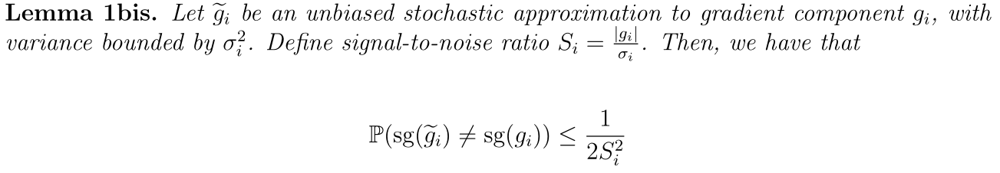
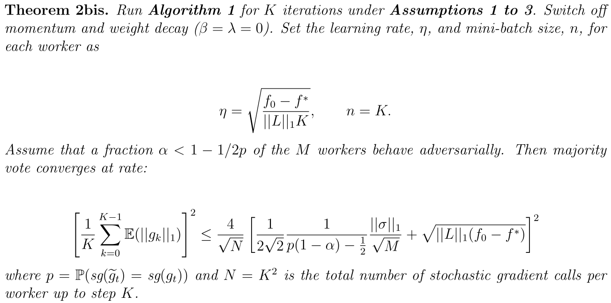
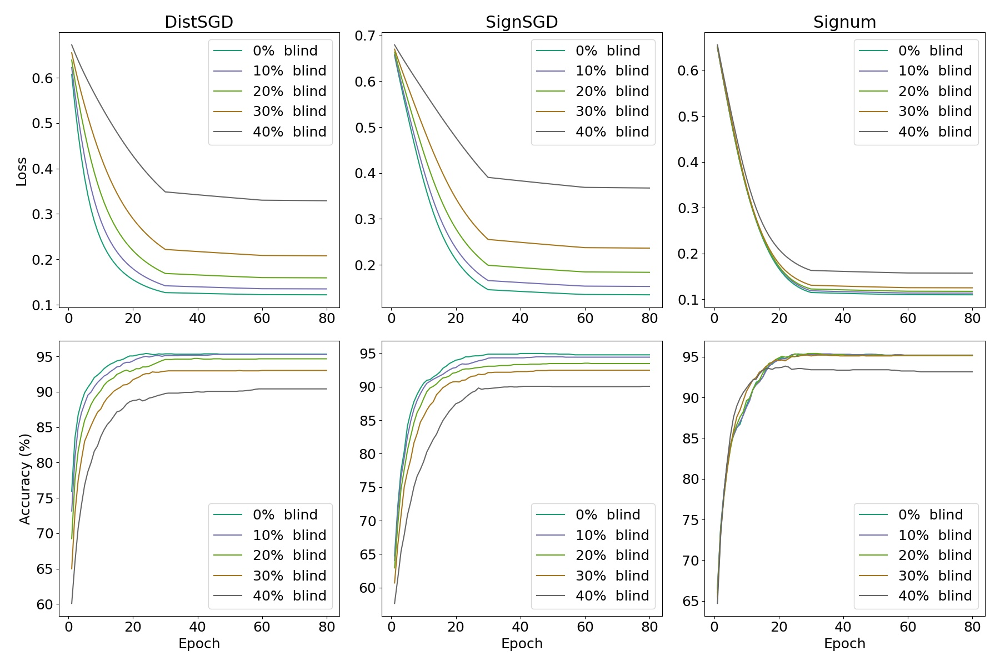
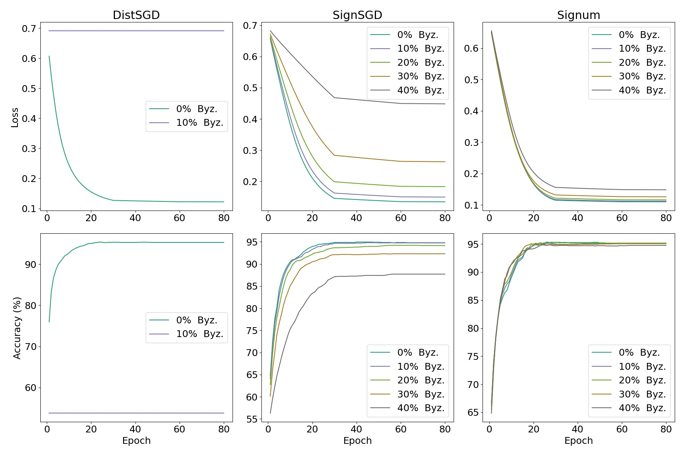
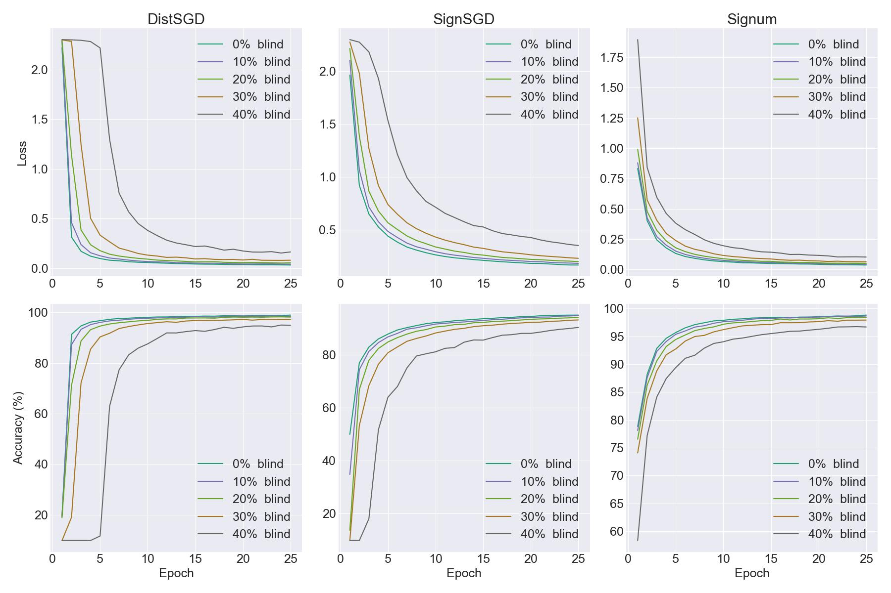
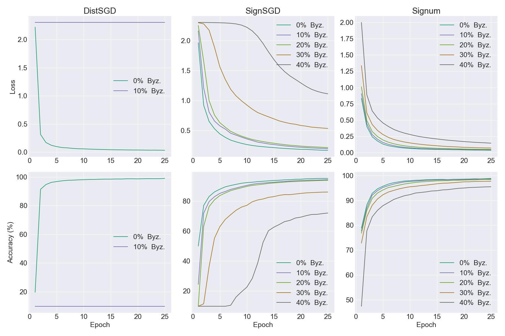

# SignSGD: Fault-Tolerance to Blind and Byzantine Adversaries

In this project, we implemented the SignSGD algorithm as described by Bernstein, Wang, Azizzadenesheli and Anandkumar in their 2018 paper [*SignSGD: Compressed Optimisation for Non-Convex Problems*][signsgd-first]. The 2019 paper [*SignSGD with Majority Vote is Communication Efficient and Fault Tolerant*][signsgd-second] from Bernstein, Zhao, Azizzadenesheli and Anandkumar also extends the properties of SignSGD by proving tolerance to blind adversaries. 

Our simple implementation aimed at assessing the convergence and fault-tolerance of SignSGD. Therefore, we have evaluated how SignSGD might be able to resist to attacks from Byzantine adversaries. Our written report is available at *report/report.pdf* and includes our theoretical proof of a upper bound for the convergence rate after relaxing an assumption from the original paper, a brief description of our implementation choices and a summary of our experimental results.

Please refer to the following sections for more information about the package usage:

1. [Some results](#some-results)
2. [Installation](#installation-instructions)
3. [Description](#package-description)
4. [Usage via command lines](#package-usage)
5. [Documentation](#documentation)

## Some Results

A more extensive explanation of our theoretical and experimental results can be found in our report under *report/report.pdf*.

### A more general theoretical bound

Our two main theoretical results are shown below.

### Experimental results

We compared the efficiency of the optimizers on basic datasets which are linear and logistic regressions along with simple feed-forward networks and on MNIST dataset. It is possible to run experiments on complex datasets such as MNIST and ImageNet, however they will run on CPU and should take longer. Thus, regressions problems are simpler and can be run on the go.

First, we plot the evolution of accuracy and loss for a logistic regression problem, when there are variable numbers of blind adversaries inverting their gradient signs. From this graph, we can deduce that blind adversaries do not prevent the models from learning. The SignSGD algorithm allows to maintain a better accuracy overall with the number of blind adversaries increasing, and Signum reduces their effect even more. Still, it is important to keep in mind that our dataset and model are basic, therefore the learning process is globally easy.

Then, we show the evolution of loss and accuracy when there are variable numbers of Byzantine adversaries. Byzantine adversaries intercept the gradients of the workers and deploy a strategy. In the case of distributed SGD, a Byzantine can send arbitrary vectors and thus stop the learning process. In the case of SignSGD, Byzantine adversaries are limited to sending signs, therefore they try to bring the aggregation to zero. Here, we see that our Byzantine strategy does not break SignSGD. Even more, the Signum version of the algorithm allows to resist to our attacks.

The second experiment that we ran was on MNIST dataset. This dataset is much more complex than a logistic regression problem, as it is an image classification task. In the case of blind adversaries, we observe that distributed SGD can resist to the attacks. However with increasing proportion of blind adversaries such as 30\% and 40\%, the learning process takes much more time. SignSGD, and more efficiently Signum, allow to reduce the effect of blind adversaries and to achieve good accuracy, although smaller than the accuracy reached with distributed SGD.

This last graph shows the evolution of loss and accuracy on MNIST when there are variable numbers of Byzantine adversaries. When there are more than 30% of Byzantine adversaries, it appears that SignSGD is less efficient, however it still allows to learn from the data with decreasing accuracy. Finally, Signum is much more fault-tolerant than SignSGD, as the algorithm allows to achieve an accuracy similar to the one with distributed SGD, even with a proportion of Byzantine adversaries close to 50%.

## Installation instructions

In order to use our package and run your own experiments, we advise you to set up a virtual environment. You will need Python >= 3.9.5 and the *virtualenv* package:

    pip3 install virtualenv

Then, you can create a virtual environment and switch to it with the following commands:

    python3 -m venv myvenv
    source myvenv/bin/activate (Linux)
    myvenv/Scripts/Activate.ps1 (Windows PowerShell)

Our experiments were run both on Windows 10 and Linux under CPU. You can install all the needed Python packages with the following command line:

    pip3 install -r requirements.txt

Otherwise, you can manually install the packages into your virtual environment.

## Package description

Below, we give a brief tree view of our package.

    .
    ├── doc  # contains a generated documentation of src/ in html
    ├── report  # contains our complete report in pdf format
    |   └── figures
    ├── src  # source code
    |   ├── datasets
    |   |   ├── __init__.py
    |   |   ├── reg_datasets.py  # allows to generate linear and logistic regression data
    |   |   └── partition_generator.py  # handle partition generation for processes
    |   ├── nn
    |   |   ├── __init__.py
    |   |   ├── reg_nets.py  # simple nn for linear and logistic regression prediction
    |   |   ├── mnist_nets.py  # gathers two models that perform well on MNIST dataset
    |   |   └── resnets.py  # gathers ResNet18 and ResNet50 for ImageNet dataset
    |   ├── optim
    |   |   ├── __init__.py
    |   |   ├── distsgd.py  # adapts SGD to a distributed setting (supports adversaries)
    |   |   └── signum.py  # implementation of Signum (supports adversaries)
    |   ├── __init__.py
    |   ├── dist_training.py  # training and evaluation functions for a distributed setting
    |   ├── main.py  # main file which you can run on command line to run experiments
    |   ├── plot_results.py  # utilitary file which you can run on command line to plot graphs
    |   └── utils.py 
    ├── README.md
    └── requirements.txt  # contains the necessary Python packages to run our files

## Package usage

Our implementation of distributed optimizers can be found under the *src/optim* folder. We have implemented a simple distributed version of SGD as well as the Signum algorithm. Note that, referring to the second paper, SignSGD corresponds to Signum when momentum is equal to zero. Both optimizers are designed to be used in a distributed setting. They can take as parameters a list of processes ranks for blind adversaries and Byzantine adversaries. The processes are expected to be numbered between zero and world size excluded.

### Model training and evaluation

You can either use the optimizers in your own code as well as our training and evaluation functions that can be found under *src/dist_training.py*, or you do have the opportunity to run the *src/main.py* file. This file allows to train some models for which we guarantee the compatibility with the optimizers and datasets. The command is as follows:

    python3 src/main.py <nprocs> <dataset> [options]

- `<nprocs>`: Number of processes. This number contains healthy workers as well as eventual adversaries to be set up with optional arguments.
- `<dataset>`: Name of the dataset from "linreg", "logreg", "mnist" and "imagenet". The "linreg" and "logreg" datasets are generated internally during the runs and can be used to demonstrate the algorithm. The "mnist" dataset contains 50,000 training and 10,000 test images of size 28x28x1 representing handwritten digits. The "imagenet" dataset contains more than 1,000,000 training and 100,000 test images of 1,000 different classes. 
- `--help` or `-h`: If selected, will show the help message and exit.
- `--blind-inv` or `-i`: Number of blind adversaries inverting their gradients signs. Default: 0.
- `--byzantine` or `-b`: Number of Byzantine adversaries. This number must not be greater than the number of processes minus the number of blind adversaries. Default: 0.
- `--seed` or `-s`: The seed to use everywhere for reproducibility. Default: 42.
- `-net` or `-n`: Name of the neural network from "linregnet", "logregnet", "torchnet", "mnistnet", "resnet18" and "resnet50". "linregnet" is only compatible with linreg dataset, as well as "logregnet" with logreg. "torchnet" and "mnistnet" are compatible with mnist dataset, while "resnet18" and "resnet50" are compatible with imagenet. Default: "mnistnet".
- `--optimizer` or `-o`: Name of the optimizer from "distsgd", "signsgd" and "signum". "distsgd" is the default stochastic gradient descent with a distributed support, "signsgd" is the distributed optimizer detailed in the paper and "signum" is equivalent to "signsgd" with a momentum parameter. Default: "signum".
- `--epochs` or `-e`: Number of training epochs. Default: 10.
- `--lr`: Learning rate. Default: 0.001.
- `--lr-decay-step`: Number of steps between each modification of the learning rate. Default: 30.
- `--lr-decay-rate`: Value by which the learning rate is multiplied every lr_decay_step. Default: 0.1.
- `--momentum`: Momentum parameter. Only available for "distsgd" and "signum" optimizers. Default: 0.0.
- `--weight-decay`: Weight decay. Only available for "signsgd" and "signum" optimizers. Default: 0.0.
- `--loss`: If True, training and test loss for each epoch will be saved in csv files. Verbose argument allows to select if files have to be written only for the mean scores or for each process. Default: True.
- `--acc`: If True, training and test accuracy for each epoch will be saved in csv files. Verbose argument allows to select if files have to be written only for the mean scores or for each process. Default: True.
- `--save-step`: Number of steps between each save of the metrics. A smaller step is convenient for longer training in order not to lose all the work in case of early stopping. Default: 10.
- `--verbose` or `-v`: If 2, will print all metrics of all processes along epochs. If 1, will show a progress bar with the mean scores. If 0, will show a raw progress bar. If loss or acc saving options are True, a verbose of 1 will allow writing files only for the mean scores while a verbose of 2 will allow writing files for each process. Default: 1.

### Plotting your results

A second file allows to plot comparative graphs of your trained models. The command is as follows:

    python3 src/plot_results.py <nprocs> <dataset> <optimizers> <metrics> [options] <subcommands> [suboptions]

- `<nprocs>`: Number of processes. This number contains healthy workers as well as eventual adversaries to be set up with optional arguments.
- `<dataset>`: Name of the dataset from "linreg", "logreg", "mnist" and "imagenet". The "linreg" and "logreg" datasets are generated internally during the runs and can be used to demonstrate the algorithm. The "mnist" dataset contains 50,000 training and 10,000 test images of size 28x28x1 representing handwritten digits. The "imagenet" dataset contains more than 1,000,000 training and 100,000 test images of 1,000 different classes. 
- `<optimizers>`: Names of optimizers from "distsgd", "signsgd" and "signum" and separated with commas. "distsgd" is the default stochastic gradient descent with a distributed support, "signsgd" is the distributed optimizer detailed in the paper and "signum" is equivalent to "signsgd" with a momentum parameter. Example: "distsgd,signsgd". Default: "signum".
- `<metrics>`: Names of metrics to plot, from "acc" and "loss" and separated with commas. Example: "acc,loss".
- `-net` or `-n`: Name of the neural network from "linregnet", "logregnet", "torchnet, "mnistnet", "resnet18" and "resnet50". "linregnet" is only compatible with linreg dataset, as well as "logregnet" with logreg. "torchnet" and "mnistnet" are compatible with mnist dataset, while "resnet18" and "resnet50" are compatible with imagenet. Default: "mnistnet".
- `--title`: If True, will add a title to the graph with the numbers of adversaries in the different runs. Default: False.
- `<subcommands>`: Mode of evaluation from "plot" and "comparison". "plot" will create a graph of one distributed setting, if it exists. "comparison" will take several numbers of blind adversaries or several numbers of Byzantine adversaries and plot a comparison of chosen metrics.
- plot + `--blind-inv` or `-i`: Number of blind adversaries inverting their gradients signs. Default: 0.
- plot + `--byzantine` or `-b`: Number of Byzantine adversaries. This number must not be greater than the number of processes minus the number of blindadversaries. Default: 0.
- comparison + `--blind-inv-list`: Numbers of blind adversaries separated with commas. Example: 0,1,2,3,4. Default: 0.
- comparison + `--byzantine-list`: Numbers of Byzantine adversaries separated with commas. Example: 0,1,2,3,4. Default: 0.

## Documentation

A complete documentation is available in the *doc/src/* folder. If it is not
generated, you can run from the root folder:

    python3 -m pdoc -o doc/ --html --config latex_math=True --force src/

Then, open *doc/src/index.html* in your browser and follow the guide!

[//]: # (References)

[signsgd-first]: https://arxiv.org/abs/1802.04434
[signsgd-second]: https://arxiv.org/abs/1810.05291
